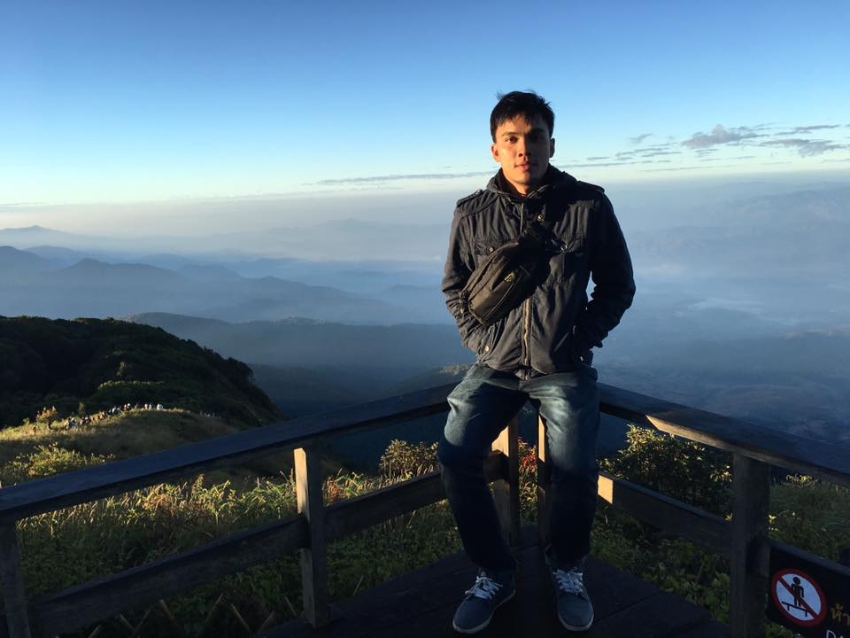

  

###

<h1 align="center">hey there 👋</h1>

###

<h3 align="left">👩‍💻  About Me</h3>

###

I'm ... from ....  - 🔭 I’m working as ... - 📚 I'm currently learning ... - ⚡ In my free time I ...

###

<h3 align="left">🛠 Language</h3>

###

  
  
  
  
  
  
  
  
  
  
  
  
  
  
  
  
  

###

<h3 align="left">🛠 Database</h3>

###

  
  
  
  
  

###

<h3 align="left">🛠 Tool</h3>

###

  
  
  
  
  
  
  
  
  

###

<h3 align="left">🛠 IOT</h3>

###

  

###

## Experience:

 
[FUSION SOFT](https://www.fusionsoft.co.th/) 
 
**September 2023 - December 2023** 
 
Professional training internship contract where I did web maintenance tasks with Laravel and Vue to a main product

 
[Tec-Soft](https://tec-soft.es/) 
 
**May 2022 - July 2022** 
 
Business desktop software development in Delphi Seattle, where I did teamwork and mantain the main products of the business solving issues in real time.

<h3 align="left">🔥   My Stats :</h3>

###
