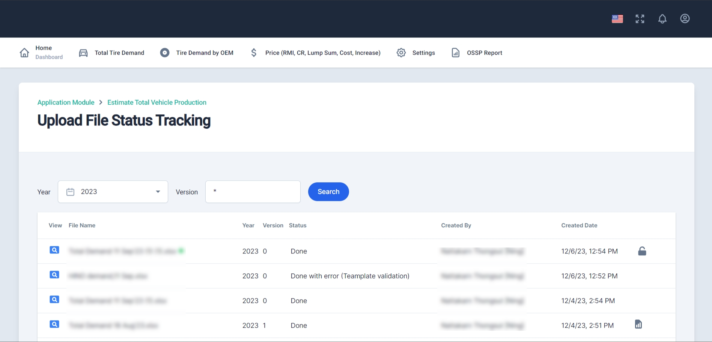
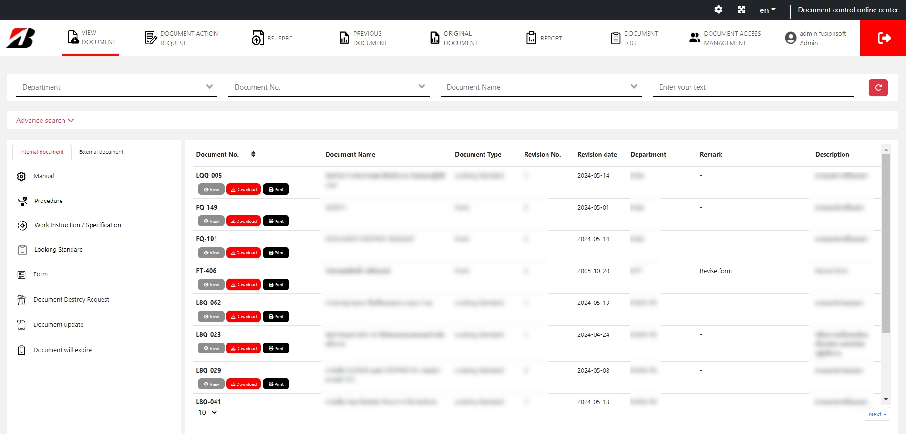
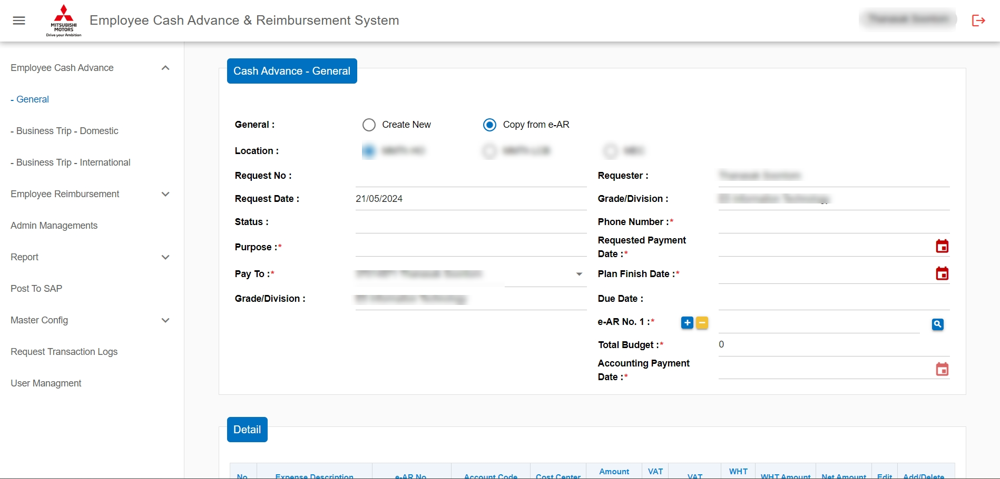
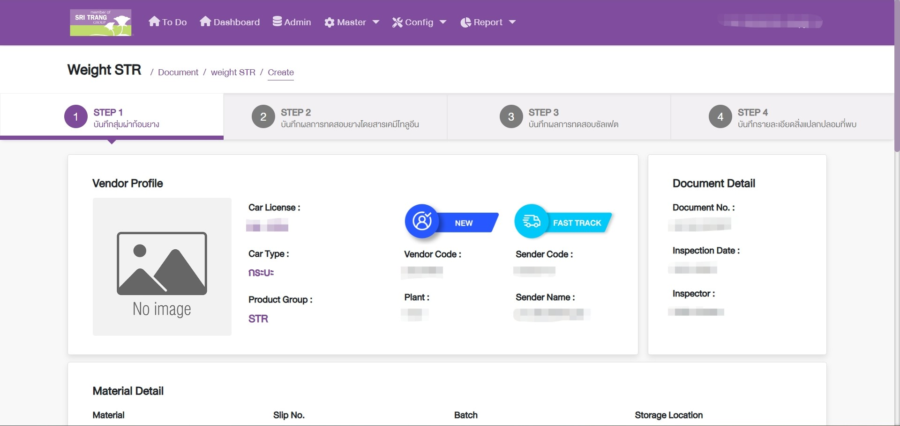

<!-- 

  

 -->

###

<!-- <h1 align="center">hey there 👋</h1>

###

<h3 align="left">👩‍💻  About Me</h3>

###

I'm ... from ....  - 🔭 I’m working as ... - 📚 I'm currently learning ... - ⚡ In my free time I ...

### -->

## <b> Skills</b>

 

<h3 align="left">Language</h3>

###

  
  
  
  
  
  
  
  
  
  
  
  
  
  
  
  
  

###

<h3 align="left">Database</h3>

###

  
  
  
  
  

###

<h3 align="left">Tool</h3>

###

  
  
  
  
  
  
  
  
  

###

<h3 align="left">🛠 Other</h3>

###

  
  
  

###

## Experience:

 
[Fusion Soft Co., Ltd](https://www.fusionsoft.co.th/) 
 
**September 2022 – Current** 
 
**Backend Developer** 
 
1.	Design Database and Develop API by Document SRS.
2.	Develop Program for SharePoint Migration.
3.	Check and improve to solve project issues.
4.	Build and install API for Windows Server.
5.	Create document for Technical Specification.

 
[Thai Summit Harness Public Company Limited.](https://www.tshpcl.com/) 
 
**August 2018 – August 2022** 
 
**Programmer** 
 
1.	Design database and develop web application by user requirement.
2.	Coordinate with suppliers to solve problems on Oracle ERP System.
3.	Design report using program QlikView by user requirement. 
4.	Check and improve to solve project issues.
5.	Build and install API for Windows Server.
6.	Create document manual.

 
[Maxxis International (Thailand) Co.,Ltd.](https://www.maxxis.co.th/MIT/index.asp) 
 
**July 2017 – August 2018** 
 
**Programmer** 
 
1.	Analyze user requirement, Design and develop windows application.
2.	Manage to solve project issues.
3.	Training User.

###

## PORTFOLIO LIST:
<!--  
**BANGCHAK**  -->
 
1. Contract Management (BANGCHAK)

 

<!--  
**BRIDGESTONE**  -->
 
2. Automatic Tire QC Check (BRIDGESTONE)
 

 
3. OE Budget (BRIDGESTONE)

 
4. Document Control (BRIDGESTONE)
 

 
5. SharePoint Archiving To Sql Server (BRIDGESTONE)
<!--   -->

<!--  
**MITSUBISHI**  -->
 
6. Migration e-Cash-Reimburse ECR (MITSUBISHI)
 

<!--  
**SRI TRANG**  -->
 
7. Web Portal for Customer (SRI TRANG)
 

<!--  
**TTB(Migration Data)**  -->
 
8. Bank Documents (TTB)
 
 
9. Rebuild website for BBD/WB on SharePoint Online (TTB)
 
 
10. Rebuild website for KMCC on SharePoint Online (TTB)
 

<!--  
**AJINOMOTO(Migration Data)**  -->
 
11. SharePoint AJT Portal Migration (AJINOMOTO)
 